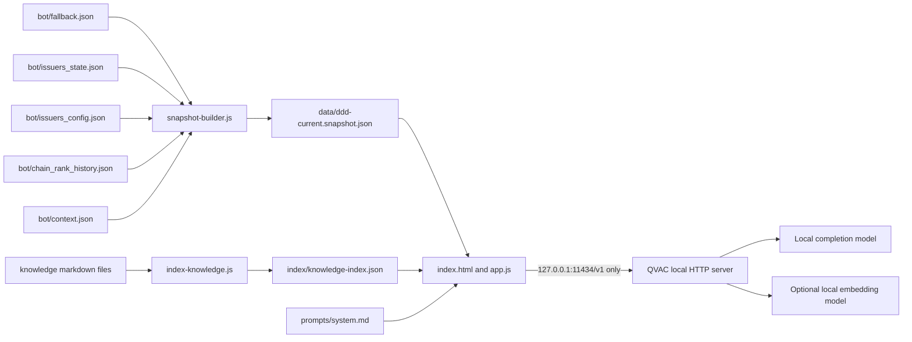

# DDD Intelligence Architecture

DDD Intelligence is an isolated local-first AI module inside the existing DDD static site.

## Core Argument

QVAC is trying to prove that AI does not need to live in a central cloud. DDD Intelligence demonstrates that with a financial data product where privacy actually matters.

The underlying DDD data is public, but the questions are not. A fund, treasury team, policy researcher, or family office may not want queries about distance from 2 percent of US M2, issuer concentration, chain share, or prediction-market resolution criteria logged by a hosted AI provider.

This is the product boundary:

- DDD measures stablecoin adoption.
- Solana can make the data composable.
- QVAC lets users interrogate the data privately on their own machine.

## Runtime Boundary

The browser page is static. It loads only local snapshot and knowledge files from the DDD repo and sends grounded prompts to the local QVAC runtime.

Allowed network traffic during offline demo:

- Same-origin static file requests from the local UI server.
- `http://127.0.0.1:11434/v1/models`.
- `http://127.0.0.1:11434/v1/chat/completions`.
- Optional `http://127.0.0.1:11434/v1/embeddings`.

Disallowed traffic:

- OpenAI.
- Claude/Anthropic.
- Gemini/Google hosted LLM APIs.
- DeFi Llama live fetches.
- FRED live fetches.
- Any cloud AI fallback.

## Data Flow

1. `npm run build:snapshot` reads existing DDD repo files and writes `data/ddd-current.snapshot.json`.
2. `npm run index:knowledge` chunks local markdown files and writes `index/knowledge-index.json`.
3. `npm run qvac:serve` starts QVAC on `127.0.0.1:11434`.
4. `npm run serve:ui` serves the repo locally on `127.0.0.1:4173`.
5. The UI retrieves top local knowledge chunks, builds a grounded prompt, and calls QVAC completion locally.
6. The answer panel displays the model response, data used, sources used, and local proof.

## Retrieval

The committed baseline is deterministic local keyword retrieval. QVAC embeddings remain optional because working local completion is the required hackathon proof. If embeddings are enabled later, vectors should be stored in `index/knowledge-index.json` and the UI/verification should display `local_qvac_embeddings`.

## Failure Behavior

If QVAC is not available, the UI does not call any cloud fallback and does not accept a hosted model answer. It reports the local QVAC failure and lists the local data/sources that were loaded.
